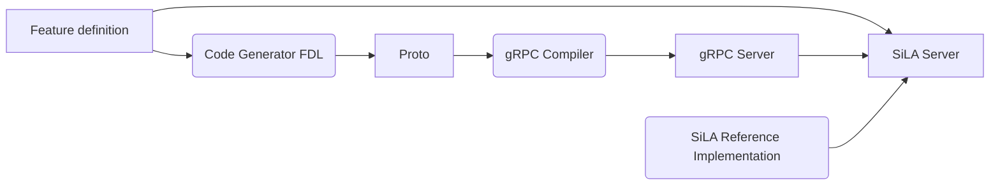
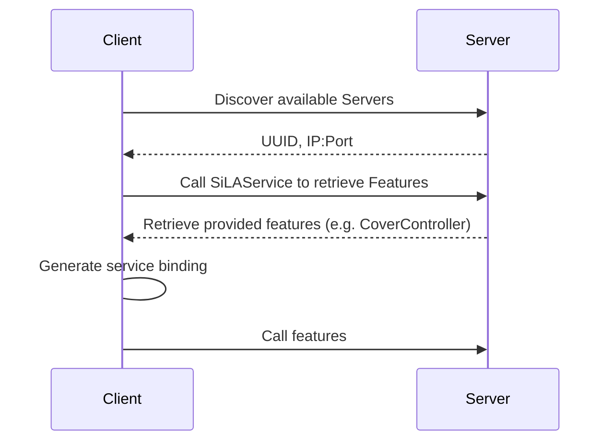

# Reference Implementations
There are different repositories that can be accessed depending on the programming language of the reference implementation, all found in the [gitlab group](https://gitlab.com/SiLA2):
* [Java](https://gitlab.com/SiLA2/sila_java) maintained by [UniteLabs](http://www.unitelabs.ch/)
* [C#](https://gitlab.com/SiLA2/sila_csharp) maintained by [EQUIcon](http://www.equicon.de/en/) and [UniteLabs](http://www.unitelabs.ch/)
* [Python](https://gitlab.com/SiLA2/sila_python) maintained by [University of Greifswald](https://www.uni-greifswald.de/en/)

Other programming languages might be added in the future, depending on the needs of the community.

# Concept
SiLA 2 runs over HTTP/2 (SiLA “Connection”) and uses Protocol Buffers to serialize payload data (the data transported between SiLA Client and SiLA Device). SiLA 2 relies on the wire format specified by gRPC to implement the Connection and transport of data. Therefore, any implementation of SiLA 2 may use the gRPC libraries to implement SiLA Clients and Devices, but may also be implemented from scratch without using gRPC, as long as the implementations strictly behaves according to the specification.

The feature definitions are defined in the [Feature Definition Language (FDL)](https://gitlab.com/SiLA2/sila_base/blob/master/schema/FeatureDefinition.xsd) whereas the interface for implementation is defined in the Protobuf Language [link](https://developers.google.com/protocol-buffers/docs/proto3).

## SiLA Server

A Feature Designer can design a Feature without any knowledge of possible SiLA Servers implementing it or the underlying principles defined in Part B. The Server implementer wishing to offer a Feature has the following workflow:
1. He uses a Code Generator to generate the complying interface proto file.
2. He uses the proto compiler to create the gRPC server classes to implement the Feature behaviour.
3. He uses a SiLA Reference Implementation to register his server with SiLA Discovery and register the Features the server wants to offer.

## SiLA Client

To use an unknown SiLA Server is a 3 step process:
1. Find the socket (IP and port) the Server provides the features on, either through network discovery or manually.
2. Get all features with the mandatory SiLAService features
3. Call the features, either precompiled or on the fly.

